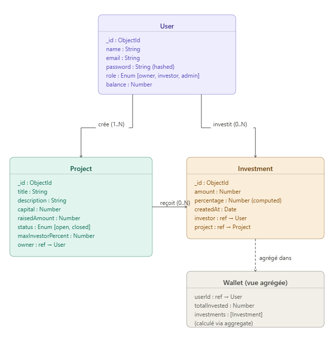
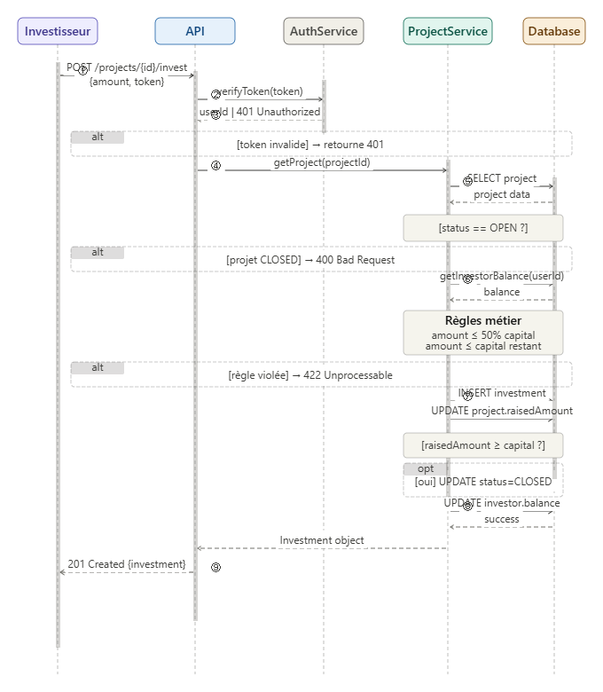
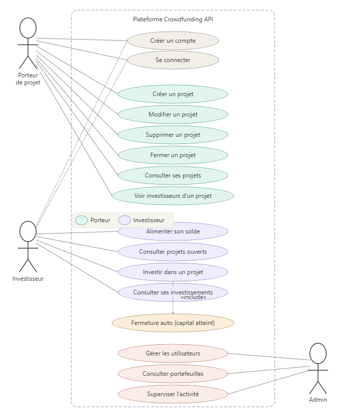

## 📐 Diagrammes UML

### Diagramme de classes


### Diagramme de séquence


### Diagramme de cas d'utilisation


## 📁 Project Structure

```
crowdfunding-api/
│
├── src/
│   ├── config/                # Configuration files (DB, environment variables)
│   │   ├── db.js
│   │   └── env.js
│   │
│   ├── models/                # Mongoose models (database schemas)
│   │   ├── User.js
│   │   ├── Project.js
│   │   ├── Investment.js
│   │   └── Wallet.js
│   │
│   ├── controllers/           # Business logic (controllers)
│   │   ├── auth/
│   │   │   ├── register.controller.js
│   │   │   └── login.controller.js
│   │   │
│   │   ├── project/
│   │   │   ├── createProject.controller.js
│   │   │   ├── updateProject.controller.js
│   │   │   ├── deleteProject.controller.js
│   │   │   ├── getMyProjects.controller.js
│   │   │   └── closeProject.controller.js
│   │   │
│   │   ├── investment/
│   │   │   ├── invest.controller.js
│   │   │   ├── getMyInvestments.controller.js
│   │   │   └── getProjectInvestors.controller.js
│   │   │
│   │   ├── wallet/
│   │   │   ├── fundWallet.controller.js
│   │   │   └── getWallet.controller.js
│   │   │
│   │   └── admin/
│   │       ├── getAllUsers.controller.js
│   │       ├── getInvestorPortfolio.controller.js
│   │       └── getOwnerPortfolio.controller.js
│   │
│   ├── routes/                # API routes
│   │   ├── auth.routes.js
│   │   ├── project.routes.js
│   │   ├── investment.routes.js
│   │   ├── wallet.routes.js
│   │   └── admin.routes.js
│   │
│   ├── middlewares/           # Custom middlewares
│   │   ├── auth.middleware.js
│   │   ├── role.middleware.js
│   │   ├── error.middleware.js
│   │   └── validation.middleware.js
│   │
│   ├── services/              # Business logic layer (services)
│   │   ├── project.service.js
│   │   ├── investment.service.js
│   │   └── wallet.service.js
│   │
│   ├── utils/                 # Helper functions
│   │   ├── calculatePercentage.js
│   │   └── checkProjectStatus.js
│   │
│   ├── validators/            # Request validation schemas
│   │   ├── auth.validator.js
│   │   ├── project.validator.js
│   │   └── investment.validator.js
│   │
│   └── app.js                 # Express app setup
│
├── server.js                  # Entry point of the application
├── .env                       # Environment variables
├── package.json              # Project dependencies and scripts
└── README.md                 # Project documentation
```
