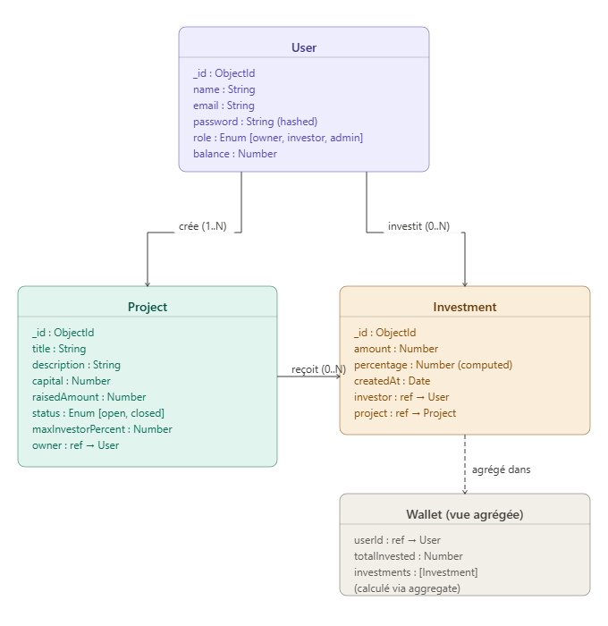
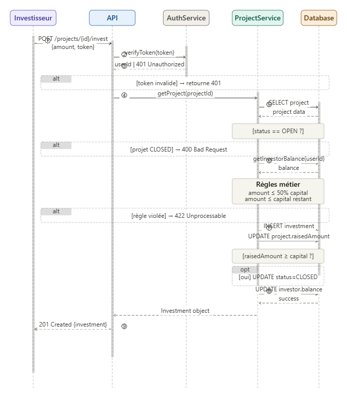
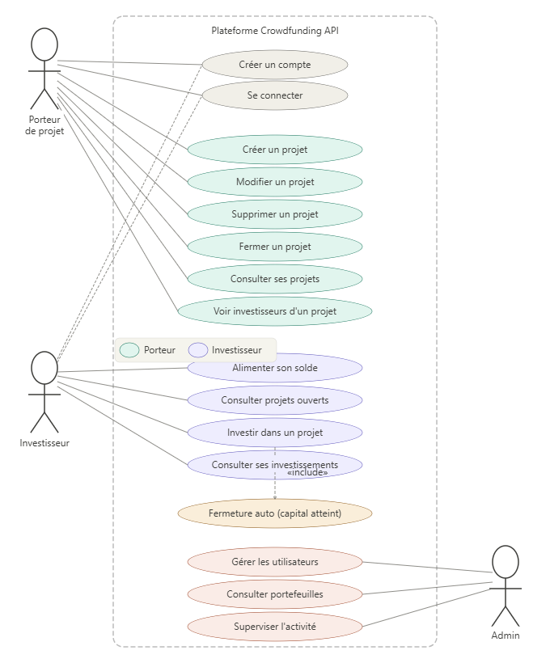

## 📐 Diagrammes UML

### Diagramme de classes


### Diagramme de séquence


### Diagramme de cas d'utilisation


## 📁 Project Structure

```
crowdfunding-api/
│
├── src/
│   ├── config/                # Configuration files (DB, environment variables)
│   │   ├── db.js
│   │   └── env.js
│   │
│   ├── models/                # Mongoose models (database schemas)
│   │   ├── User.js
│   │   ├── Project.js
│   │   ├── Investment.js
│   │   └── Wallet.js
│   │
│   ├── controllers/           # Business logic (controllers)
│   │   ├── auth/
│   │   │   ├── register.controller.js
│   │   │   └── login.controller.js
│   │   │
│   │   ├── project/
│   │   │   ├── createProject.controller.js
│   │   │   ├── updateProject.controller.js
│   │   │   ├── deleteProject.controller.js
│   │   │   ├── getMyProjects.controller.js
│   │   │   └── closeProject.controller.js
│   │   │
│   │   ├── investment/
│   │   │   ├── invest.controller.js
│   │   │   ├── getMyInvestments.controller.js
│   │   │   └── getProjectInvestors.controller.js
│   │   │
│   │   ├── wallet/
│   │   │   ├── fundWallet.controller.js
│   │   │   └── getWallet.controller.js
│   │   │
│   │   └── admin/
│   │       ├── getAllUsers.controller.js
│   │       ├── getInvestorPortfolio.controller.js
│   │       └── getOwnerPortfolio.controller.js
│   │
│   ├── routes/                # API routes
│   │   ├── auth.routes.js
│   │   ├── project.routes.js
│   │   ├── investment.routes.js
│   │   ├── wallet.routes.js
│   │   └── admin.routes.js
│   │
│   ├── middlewares/           # Custom middlewares
│   │   ├── auth.middleware.js
│   │   ├── role.middleware.js
│   │   ├── error.middleware.js
│   │   └── validation.middleware.js
│   │
│   ├── services/              # Business logic layer (services)
│   │   ├── project.service.js
│   │   ├── investment.service.js
│   │   └── wallet.service.js
│   │
│   ├── utils/                 # Helper functions
│   │   ├── calculatePercentage.js
│   │   └── checkProjectStatus.js
│   │
│   ├── validators/            # Request validation schemas
│   │   ├── auth.validator.js
│   │   ├── project.validator.js
│   │   └── investment.validator.js
│   │
│   └── app.js                 # Express app setup
│
├── server.js                  # Entry point of the application
├── .env                       # Environment variables
├── package.json              # Project dependencies and scripts
└── README.md                 # Project documentation
```
# Crowdfunder – Plateforme de Financement Participatif

## 1. Nom du projet

**Nom du projet :** Investor-Platform

---

# 2. Présentation du projet

Crowdfunder ou Investor-Platform est une application web de financement participatif permettant aux investisseurs de découvrir des projets, d'investir dans ceux qui les intéressent et de gérer leur portefeuille d'investissements.

Elle s'adresse principalement aux investisseurs souhaitant financer des projets innovants ainsi qu'aux porteurs de projets recherchant des financements.

Son objectif principal est de proposer une plateforme simple, intuitive et sécurisée permettant de suivre les investissements en temps réel.

---

# 3. Problématique

Le problème identifié est qu'il est souvent difficile pour les investisseurs de trouver une plateforme simple leur permettant de découvrir des projets, d'investir facilement et de suivre leurs participations.

La solution proposée permet de consulter les projets disponibles, d'effectuer des investissements, d'alimenter son portefeuille et de suivre l'ensemble de ses participations depuis un tableau de bord unique.

---

# 4. Fonctionnalités principales

- Créer un compte investisseur
- Se connecter à son espace personnel
- Consulter la liste des projets disponibles
- Rechercher et filtrer les projets
- Investir dans un projet
- Consulter et gérer son portefeuille d'investissements

---

# 5. Technologies utilisées

| Technologie          | Utilisation dans le projet                            |
| -------------------- | ----------------------------------------------------- |
| React.js             | Développement de l'interface utilisateur              |
| Redux Toolkit        | Gestion de l'état global de l'application             |
| React Router         | Navigation entre les différentes pages                |
| Axios                | Communication avec l'API REST                         |
| Tailwind CSS         | Mise en forme et conception responsive de l'interface |
| Node.js & Express.js | Développement de l'API Backend                        |
| MongoDB              | Stockage des données                                  |
| JWT                  | Authentification sécurisée des utilisateurs           |
| Git & GitHub         | Gestion des versions du projet                        |

Nous avons utilisé **Redux Toolkit** afin de centraliser la gestion des données de l'application grâce aux slices, au Store Redux et à `createAsyncThunk`.

---

# 6. Installation et lancement

## 6.1 Prérequis

Pour utiliser ce projet, vous devez disposer de :

- Node.js
- npm
- Git
- MongoDB
- Visual Studio Code

---

## 6.2 Cloner le dépôt

```bash
git clone https://github.com/ayoubhanine/Investor-Platform.git
```

---

## 6.3 Ouvrir le dossier

```bash
cd Investor-Platform
```

---

## 6.4 Installer les dépendances

### Frontend

```bash
cd client
npm install
```

### Backend

```bash
cd server
npm install
```

---

## 6.5 Variables d'environnement

### Backend (.env)

```env
PORT=5000

MONGODB_URI=your_mongodb_connection

JWT_SECRET=your_secret_key
```

### Frontend (.env)

```env
VITE_API_URL=http://localhost:5000/api
```

---

## 6.6 Lancer le projet

### Backend

```bash
cd server
npm run dev
```

### Frontend

```bash
cd client
npm run dev
```

---

## 6.7 Ouvrir le projet

Frontend

```
http://localhost:5173
```

Backend

```
http://localhost:5000
```

---

# 7. Captures d'écran

## Capture 1

### Tableau de bord Investisseur

```md

```

Cette capture montre le tableau de bord de l'investisseur avec le solde disponible, le montant total investi et les statistiques générales.

---

## Capture 2

### Liste des projets

```md

```

Cette capture montre la liste des projets disponibles avec la recherche, les filtres et les informations de chaque projet.

---

# 8. Contribution personnelle

Ma contribution principale a porté sur le développement complet de l'interface utilisateur avec React.

J'ai également travaillé sur la mise en place de Redux Toolkit (Store, Slices, createAsyncThunk), l'intégration des appels API, le routage avec React Router ainsi que la gestion des états de chargement, des erreurs et des résultats.

J'ai été responsable de l'intégration entre le Frontend et le Backend, de la gestion des investissements, du portefeuille investisseur et du tableau de bord.

---

# 9. Difficultés rencontrées

## Difficulté 1

### Problème rencontré

Synchroniser les différents états Redux entre le portefeuille, les projets et les investissements.

### Recherches / Tests

Étude de la documentation officielle Redux Toolkit et réalisation de plusieurs tests avec Redux DevTools.

### Solution

Utilisation de plusieurs slices indépendants et de `createAsyncThunk` pour gérer les appels API asynchrones.

### Ce que j'ai appris

Cette difficulté m'a permis de mieux comprendre l'organisation d'un Store Redux complexe et la communication entre plusieurs slices.

---

## Difficulté 2

### Problème rencontré

Gérer la protection des routes nécessitant une authentification.

### Recherches / Tests

Lecture de la documentation JWT et tests de plusieurs méthodes de stockage du token.

### Solution

Mise en place d'une authentification basée sur JWT avec protection des routes privées.

### Ce que j'ai appris

Cette difficulté m'a permis de mieux comprendre le fonctionnement de l'authentification sécurisée dans une application React.

---

# 10. Améliorations possibles

Dans une prochaine version, je pourrais :

- Ajouter les paiements en ligne (Stripe ou PayPal).
- Envoyer des notifications en temps réel.
- Ajouter des tests unitaires et d'intégration.
- Déployer l'application sur Vercel et Render.

## Conclusion

Ces améliorations permettraient d'améliorer la sécurité, les performances et l'expérience utilisateur tout en rendant la plateforme prête pour une utilisation en production.

---

# ✅ Checklist finale

- Projet clairement présenté.
- Fonctionnalités principales décrites.
- Technologies expliquées.
- Installation documentée.
- Captures d'écran prévues.
- Contribution personnelle précisée.
- Difficultés rencontrées expliquées.
- Pistes d'amélioration proposées.
